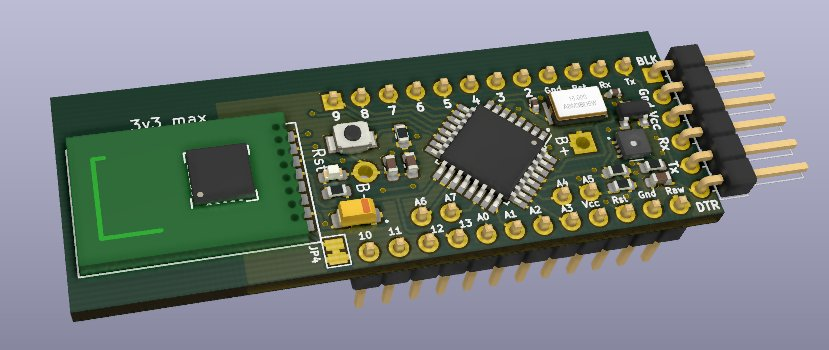

# Mysensors all-in-one node

This is an all-in-one node for Mysensors, with the following features designed:

 * Almost pin-for-pin compatible dropin for an Arduino Pro Mini
 * Built-in pads for an SMD NRF24L01 radio module
 * On-board SHT30 temperature and humidity sensor
 * On-board ATSHA204A crypto chip
 * Built in pads for a CR2032 coin cell holder
 * Ready to be sent to a fab-house such as [JLCPCB](https://jlcpcb.com)

Where it differs from a regular Arduino Pro Mini is:

 * No voltage regulator (allows low-power operation), 3.3v max VCC/RAW
 * A4/A5/A6/A7 shifted slightly to fit standard protoboard spacing

